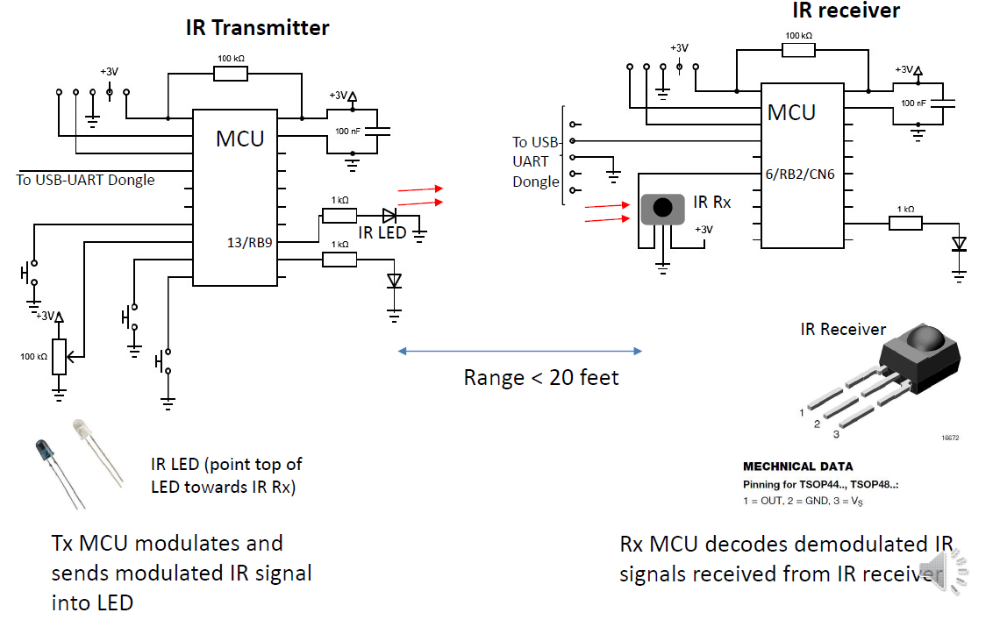
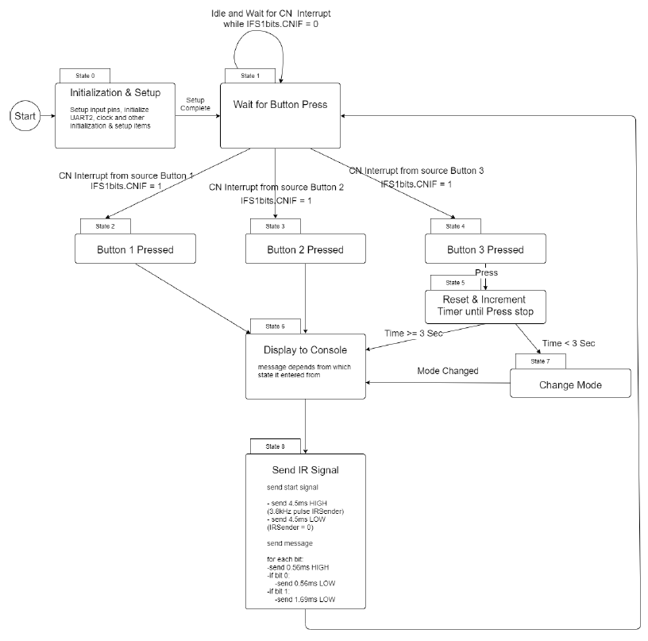
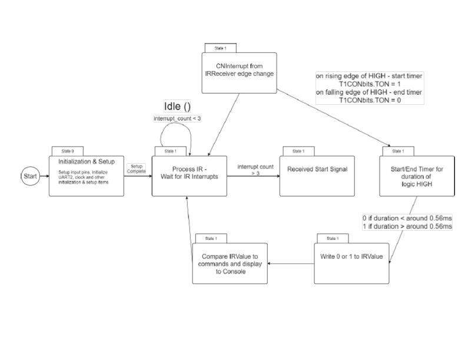
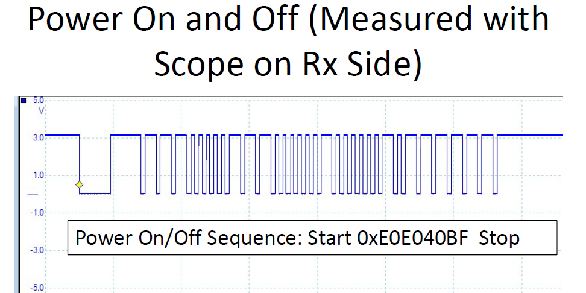
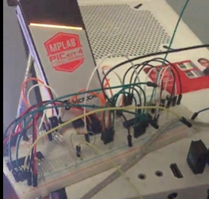

# NEC IR TX RX Remote Simulation

## Introduction
This project involves developing an embedded system simulating a universal TV remote control using a PIC24F microcontroller. The system uses IR communication to send and receive commands based on NEC IR codes to control power, channel, and volume. The project included designing an IR transmitter and receiver, with the transmitter sending specific IR signals corresponding to NEC IR codes for various TV remote commands, specifically programmed for Samsung TVs. The receiver decodes these signals and displays the corresponding command on a terminal window. The device was successfully tested on a television.

## Images and Diagrams

## Hardware

- **Schematics:**
  -

- **State Diagrams:**
  - 
  - 

- **Oscilloscope Capture:**
  - 

- **Hardware Setup:**
  - 
## Features
- **IR Transmitter:**
  - Sends IR signals for power on/off, channel up/down, and volume up/down.
- **IR Receiver:**
  - Receives IR signals and identifies commands.
  - Displays the received command and its HEX value on a PC terminal.

## Testing

| User Input(s)                                   | Output(s)                                                                                       |
|-------------------------------------------------|-------------------------------------------------------------------------------------------------|
| While PB3 is pressed for 3 sec or more          | “TV ON/Off command received” and the HEX command value received is displayed on PC terminal.    |
| When the system is in Channel mode and PB1 is pressed | “Channel mode: Channel up received” and the HEX command value received is displayed on PC terminal. |
| When the system is in Channel mode and PB2 is pressed | “Channel mode: Channel down received” and the HEX command value received is displayed on PC terminal. |
| When the system is in Volume mode and PB1 is pressed | “Volume mode: Volume up received” and the HEX command value received is displayed on PC terminal. |
| When the system is in Volume mode and PB2 is pressed | “Volume mode: Volume down received” and the HEX command value received is displayed on PC terminal. |

- The device was successfully tested on a Samsung TV, demonstrating its functionality in controlling power, channel, and volume.
- The system can be modified to work with various IR receiver televisions using NEC IR codes.

